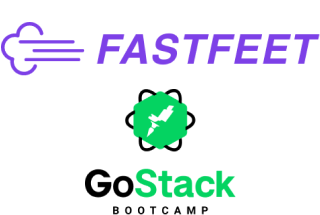

<h1 align="center">
  
</h1>

## :computer: Instalação, execução e desenvolvimento

Faça um clone desse repositório.

### Pré-requisitos

- [Docker](https://www.docker.com/)
- [Docker Compose](https://docs.docker.com/compose/)

### Backend

- A partir da raiz do projeto, entre na pasta rodando `cd backend`;
- Rode `yarn` para instalar sua dependências;
<!-- - Rode `cp .env.example .env` e preencha o arquivo `.env` com SUAS variáveis ambiente; -->
<!-- - Rode `docker-compose up -d` para montar o ambiente; -->
- Rode `yarn sequelize db:migrate` para executar as migrations;
- Para executar somente a migration de `admin-user` rode o comando `yarn sequelize db:seed --seed 20200130025925-admin-user.js`

# fastfeet
